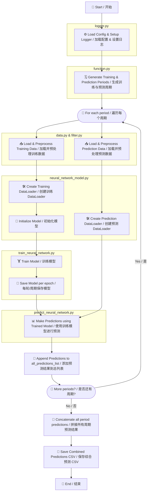

# 📈 StockPredictor Pipeline Flowchart / 预测器流程图

This document visualizes the main workflow of the StockPredictor pipeline.  
本文件展示了 StockPredictor 股票预测的主要工作流程。

## 🧠 Neural network model / 神经网络模型


## 🌳 Ensemble model / 集成模型

```mermaid
flowchart TB
    A[🏁 Start / 开始] --> B[⚙️ Load Config & Setup Logger / 加载配置 & 设置日志]
    B --> C[🗓️ Generate Training & Prediction Periods / 生成训练与预测周期]
    C --> D([🔄 For each period / 遍历每个周期])

    D --> E[📥 Load & Preprocess Training Data / 加载并预处理训练数据]
    D --> F[📥 Load & Preprocess Prediction Data / 加载并预处理预测数据]

    E --> G[🧠 Initialize LightGBM Model / 初始化 LightGBM 基模型]
    G --> H[🏋️ Train LightGBM Model / 训练 LightGBM 基模型]
    H --> I[💾 Save LightGBM Model / 保存 LightGBM 模型]

    F --> J[📊 Make Predictions using LightGBM / 使用 LightGBM 进行预测]
    I --> J

    J --> K[🧮 Aggregate / Ensemble Predictions / 聚合预测结果]

    K --> L[📝 Append Predictions to all_predictions_list / 添加到总预测列表]

    L --> M([🔁 More periods? / 是否还有周期?])
    M -- Yes / 是 --> D
    M -- No / 否 --> N[📎 Concatenate all period predictions / 拼接所有周期预测结果]
    N --> O[💾 Save Combined Predictions CSV / 保存综合预测 CSV]
    O --> P[🏁 End / 结束]

    subgraph logger.py
    B
    end

    subgraph function.py
    C
    end

    subgraph data.py & filter.py
    E
    F
    end

    subgraph train_ensemble.py
    G
    H
    I
    end

    subgraph predict_ensemble.py
    J
    K
    end
